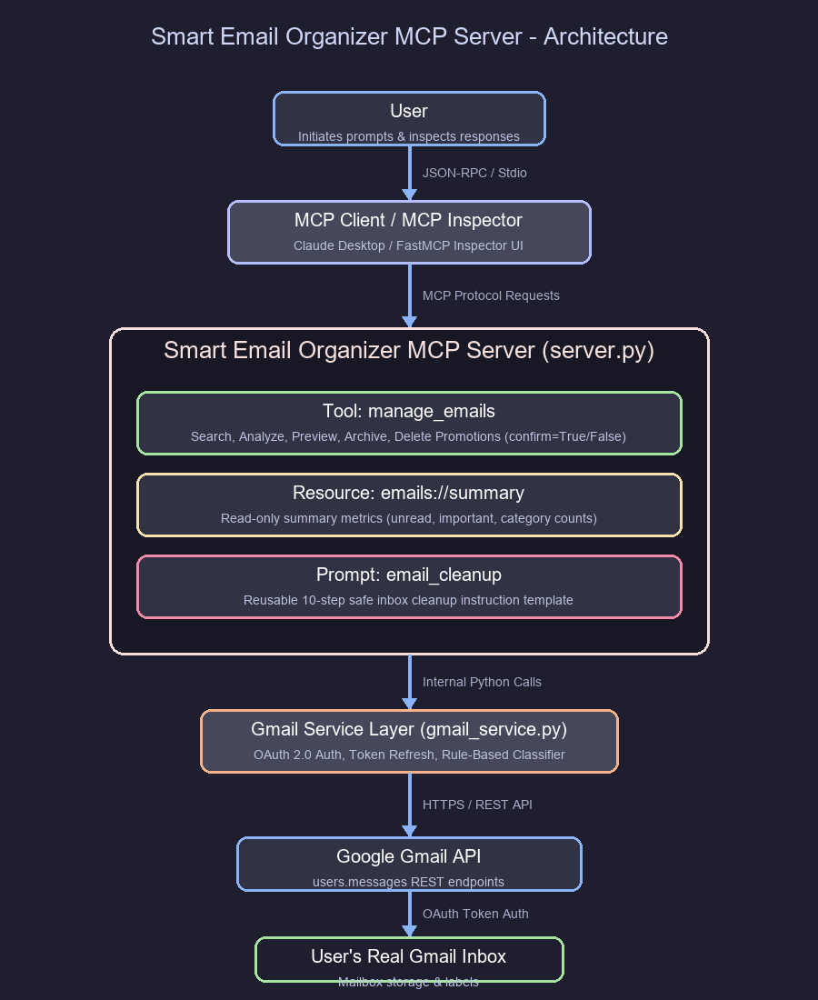

# Smart Email Organizer MCP Server

A production-style, beginner-friendly Model Context Protocol (MCP) server that connects to your real Gmail account using Google OAuth 2.0. It provides safe email analysis, rule-based categorization, inbox summary metrics, and a multi-step confirmation mechanism for promotional email deletion.

Built for an **MCP Fundamentals Assignment**, this project strictly implements **exactly three MCP primitives**:
- **1 TOOL**: `manage_emails`
- **1 RESOURCE**: `emails://summary`
- **1 PROMPT**: `email_cleanup`

---

## 1. Project Title
**Smart Email Organizer MCP Server**

## 2. Problem Statement
Modern email inboxes receive dozens of newsletters, marketing updates, promotional broadcasts, and automated notifications daily. Managing this clutter manually is tedious and time-consuming. While AI agents powered by Large Language Models can intelligently process and organize inbox data, blindly giving an AI permission to modify or delete emails poses major data loss and security risks.

## 3. Objective
The objective of this project is to create a secure, production-grade MCP server that bridges an LLM agent with a user's real Gmail inbox while maintaining safety, privacy, and full user control. The server enables AI-assisted email searching, categorizing, archiving, and promotional email cleanup—without EVER performing unconfirmed deletions.

---

## 4. Features
- 🔑 **Secure OAuth 2.0 Integration**: Uses Google's standard Desktop Client OAuth 2.0 flow. Password is never requested or stored.
- 🏷️ **Transparent Multi-Attribute Email Categorization**: Classifies emails into `important`, `job`, `internship`, `college`, `newsletter`, `promotion`, `personal`, and `other` using sender, subject, snippet, and Gmail system labels.
- 🛡️ **Two-Phase Delete Safety**: Permanent deletion requires explicit user preview and `confirm=True` confirmation.
- 📊 **Read-Only Summary Resource**: Instant access to inbox metric statistics via `emails://summary`.
- 📋 **Reusable AI Prompt Template**: Standardized 10-step protocol (`email_cleanup`) guiding AI clients through safe organization workflows.

---

## 5. System Architecture

### Data Flow Diagram



### Data Flow Explanation
1. **User / MCP Client**: The user interacts with an MCP host (such as Claude Desktop or the FastMCP Inspector UI) and requests email actions.
2. **MCP Communication Layer**: Requests are sent to the `server.py` FastMCP server via standard JSON-RPC protocol over Stdio.
3. **MCP Primitives Layer**:
   - **Tool (`manage_emails`)**: Executes operations like search, analyze, preview, archive, and confirmed deletion.
   - **Resource (`emails://summary`)**: Serves read-only inbox metrics.
   - **Prompt (`email_cleanup`)**: Supplies structured multi-step cleanup instructions.
4. **Gmail Service Layer (`gmail_service.py`)**: Handles Google OAuth 2.0 token management, refresh cycles, and API payload formatting.
5. **Email Classifier (`email_classifier.py`)**: Applies transparent rule heuristics to categorize emails into 8 structured buckets.
6. **Google Gmail API**: Interacts securely with Google's REST endpoints (`users.messages`).
7. **User's Gmail Account**: Applies requested changes (moving messages to Trash or removing the `INBOX` label for archiving).

---

## 6. Gmail API Setup
To connect this server to your Gmail account, you must enable the Gmail API in Google Cloud Console.

1. Go to the [Google Cloud Console](https://console.cloud.google.com/).
2. Click **Select a project** > **New Project**.
3. Name your project `Smart Email Organizer` and click **Create**.
4. In the left menu, select **APIs & Services** > **Library**.
5. Search for **Gmail API**, click on it, and click **Enable**.

---

## 7. Google Cloud Configuration
Before creating OAuth credentials, you must configure the OAuth consent screen.

1. Navigate to **APIs & Services** > **OAuth consent screen**.
2. Select User Type: **External** (or **Internal** for Google Workspace accounts) and click **Create**.
3. Enter App Information:
   - **App name**: `Smart Email Organizer MCP Server`
   - **User support email**: Your Gmail address
   - **Developer contact info**: Your email address
4. Click **Save and Continue**.
5. Under **Scopes**, click **Add or Remove Scopes**:
   - Search for `https://www.googleapis.com/auth/gmail.modify`
   - Check the box and click **Update**.
6. Under **Test users**, click **Add Users** and enter your Gmail address. Click **Save**.

---

## 8. OAuth Setup
Create Desktop OAuth Client Credentials to enable local browser-based authentication.

1. Go to **APIs & Services** > **Credentials**.
2. Click **+ Create Credentials** > **OAuth client ID**.
3. Choose Application type: **Desktop app**.
4. Name: `Smart Email Organizer Desktop Client`.
5. Click **Create**.
6. Click **Download JSON** in the popup window.
7. Save the downloaded file as `credentials.json` inside the `credentials/` folder:
   ```
   smart-email-organizer-mcp/credentials/credentials.json
   ```

---

## 9. Installation

### Prerequisites
- Python 3.10+ (Python 3.12 recommended)
- `pip` or `uv` package manager

### Clone & Install Dependencies
```bash
# Clone repository
git clone https://github.com/your-username/smart-email-organizer-mcp.git
cd smart-email-organizer-mcp

# Create virtual environment
python -m venv .venv

# Activate virtual environment
# Windows (PowerShell):
.venv\Scripts\Activate.ps1
# macOS/Linux:
source .venv/bin/activate

# Install dependencies in editable mode
pip install -e .
```

---

## 10. Configuration
Ensure your directory structure matches:
```
smart-email-organizer-mcp/
├── server.py
├── gmail_service.py
├── email_classifier.py
├── pyproject.toml
├── README.md
├── .gitignore
├── credentials/
│   ├── README.md
│   └── credentials.json    <-- Place your downloaded OAuth JSON here!
└── docs/
    ├── architecture.png
    └── theory.tex
```

---

## 11. Running the Server

Start the server using standard Python:
```bash
python server.py
```

Upon first run (or when calling tools), a browser window will pop up prompting you to log in to your Google Account and grant permission. After authorizing, a `credentials/token.json` file will automatically be created to store your access session.

---

## 12. MCP Inspector Testing

You can interactively inspect and test all 3 MCP primitives using the official `@modelcontextprotocol/inspector`:

```bash
npx @modelcontextprotocol/inspector python server.py
```

1. Open the URL printed by the inspector (e.g. `http://localhost:5173`).
2. Navigate to **Tools** tab:
   - Select `manage_emails`
   - Test with arguments: `{"action": "analyze"}`
   - Test promotional preview: `{"action": "preview_promotions"}`
   - Test safe deletion check: `{"action": "delete_promotions", "confirm": false}`
3. Navigate to **Resources** tab:
   - Select `emails://summary` and click **Read Resource**.
4. Navigate to **Prompts** tab:
   - Select `email_cleanup` and click **Get Prompt**.

---

## 13. Tool Documentation

### `manage_emails` (1 Tool)
Exposes email management operations.

#### Concept: What is an MCP Tool?
An **MCP Tool** allows an AI agent to execute actions or state-changing operations in an external system.

#### Signature
```python
manage_emails(
    action: str,
    query: Optional[str] = None,
    category: Optional[str] = None,
    confirm: bool = False,
    max_results: int = 50
) -> str
```

#### Parameters
| Parameter | Type | Default | Description |
|-----------|------|---------|-------------|
| `action` | `str` | *Required* | Operation to perform (`search`, `analyze`, `preview_promotions`, `archive`, `delete_promotions`). |
| `query` | `str` | `None` | Optional Gmail query string (e.g. `from:recruiter`, `label:UNREAD`). |
| `category` | `str` | `None` | Optional category filter (`important`, `job`, `internship`, `college`, `newsletter`, `promotion`, `personal`, `other`). |
| `confirm` | `bool` | `False` | Safety confirmation flag required for destructive operations like deletion. |
| `max_results` | `int` | `50` | Maximum number of emails to retrieve/process. |

#### Example Usage

**1. Search Emails:**
```json
{
  "action": "search",
  "query": "internship",
  "max_results": 10
}
```

**2. Analyze Inbox:**
```json
{
  "action": "analyze"
}
```

**3. Preview Promotional Emails:**
```json
{
  "action": "preview_promotions"
}
```

**4. Attempt Delete (Unconfirmed - Safety Triggered):**
```json
{
  "action": "delete_promotions",
  "confirm": false
}
```
*Output:*
```json
{
  "status": "requires_confirmation",
  "confirm": false,
  "target_count": 5,
  "warning": "SAFETY CHECK: Confirmation is required before deleting emails.",
  "preview": [...]
}
```

**5. Confirmed Delete:**
```json
{
  "action": "delete_promotions",
  "confirm": true
}
```

---

## 14. Resource Documentation

### `emails://summary` (1 Resource)

#### Concept: What is an MCP Resource?
An **MCP Resource** provides **read-only context data** to an AI model. Unlike tools, resources **never** perform actions or modify state.

#### URI
`emails://summary`

#### Description
Returns structured JSON data providing a real-time summary of inbox counts across unread, important, job, internship, college, newsletter, promotional, and personal email categories.

#### Example Output
```json
{
  "resource_uri": "emails://summary",
  "access_type": "read-only",
  "total_emails_inspected": 50,
  "unread_emails": 12,
  "important_flagged_emails": 4,
  "category_counts": {
    "important": 4,
    "job": 3,
    "internship": 2,
    "college": 5,
    "newsletter": 8,
    "promotion": 15,
    "personal": 10,
    "other": 3
  },
  "status": "success"
}
```

---

## 15. Prompt Documentation

### `email_cleanup` (1 Prompt)

#### Concept: What is an MCP Prompt?
An **MCP Prompt** provides reusable system instructions and protocols that standardizes how an AI client behaves when interacting with tools and resources.

#### Description
A standardized 10-step cleanup protocol enforcing inbox categorization, prioritization of important messages, preview generation, and strict user confirmation before executing deletions.

#### Content Instructions
1. Analyze inbox via `manage_emails(action='analyze')` or `emails://summary`.
2. Identify important emails.
3. Identify job & internship emails.
4. Identify college/academic emails.
5. Identify newsletters.
6. Identify promotional emails.
7. Prioritize important emails.
8. Preview promotional emails before requesting deletion.
9. **NEVER** delete emails without explicit user confirmation (`confirm=True`).
10. Provide a clear cleanup summary report.

---

## 16. Safety Considerations
- **No Unconfirmed Deletions**: Ambiguous phrases such as *"clean my inbox"*, *"get rid of junk"*, or *"remove promotions"* will **NEVER** trigger automatic deletion. The tool requires `confirm=True` explicitly.
- **Soft Delete (Trash)**: Deletions are sent to Gmail's native `Trash` folder, ensuring users have 30 days to recover any accidentally deleted messages.
- **Archive First**: High-value categories (job, internship, college, important) are protected and recommended for archiving rather than deletion.

---

## 17. Privacy Considerations
- **Local Credentials**: OAuth tokens (`token.json`) and client secrets (`credentials.json`) remain strictly on your local machine.
- **Minimal Scopes**: Requests only `https://www.googleapis.com/auth/gmail.modify` scope—no full admin privileges or external credential sharing.
- **Zero Third-Party Storage**: Email content and metadata are passed dynamically in memory via Stdio and are never logged or exported to remote databases.

---

## 18. GitHub Setup
When pushing to GitHub, verify that all sensitive files are excluded.

### `.gitignore` Enforcement
The `.gitignore` file explicitly blocks:
```gitignore
credentials.json
token.json
credentials/credentials.json
credentials/token.json
.env
*.secret
__pycache__/
.venv/
```

Before committing, run:
```bash
git status
```
Verify that `credentials.json` and `token.json` **DO NOT** appear under untracked files!

---

## 19. Troubleshooting

### Problem: `FileNotFoundError: OAuth Client Credentials file missing...`
- **Solution**: Follow Section 8 to download your OAuth JSON from Google Cloud Console, save it as `credentials.json` inside the `credentials/` folder.

### Problem: `google.auth.exceptions.RefreshError: Token has been expired or revoked.`
- **Solution**: Delete `credentials/token.json` and re-run `python server.py`. A fresh browser OAuth flow will initiate.

### Problem: `HttpError 403: Insufficient Permission`
- **Solution**: Ensure your OAuth consent screen has added `https://www.googleapis.com/auth/gmail.modify` scope and your Gmail address is listed under **Test users**.

---

## 20. Future Scope
- **Multi-Account Support**: Extend OAuth configuration to manage multiple Gmail accounts simultaneously.
- **LLM-Based Semantic Categorization**: Integrate local embeddings or LLM semantic classifiers for complex email contexts.
- **Rule-Based Custom Filters**: Allow users to define custom regex rules for automatic label application.
- **Scheduled Auto-Archiving**: Support background cron schedules for periodic archiving of read newsletters.

---

## 21. Assignment Compliance Verification

| Requirement | Assignment Constraint | Project Implementation Status |
|-------------|-----------------------|--------------------------------|
| **MCP Tools** | Exactly 1 Tool (`manage_emails`) | ✅ Satisfied (`@mcp.tool` in `server.py`) |
| **MCP Resources** | Exactly 1 Resource (`emails://summary`) | ✅ Satisfied (`@mcp.resource` in `server.py`) |
| **MCP Prompts** | Exactly 1 Prompt (`email_cleanup`) | ✅ Satisfied (`@mcp.prompt` in `server.py`) |
| **Authentication** | Google OAuth 2.0 (No password storage) | ✅ Satisfied (`gmail_service.py`) |
| **Deletion Safety** | Preview + explicit `confirm=True` check | ✅ Satisfied (`server.py`) |
| **Category Heuristics** | 8 categories with rule-based fallback | ✅ Satisfied (`email_classifier.py`) |

---
*Developed with FastMCP and Google Gmail API for MCP Fundamentals.*
